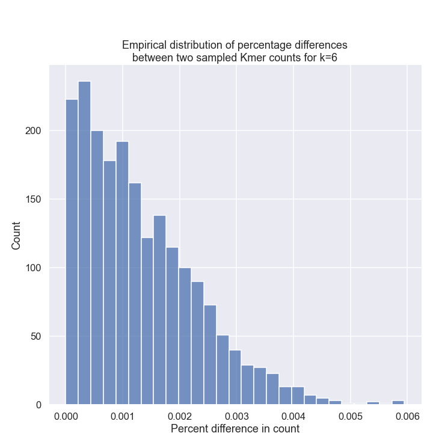

## Chargaff's second party rule test

I was curious to see what is the probability of observing a very close count difference between a kmer and it's reverse compliment in a genome. 

For that I assumed the count of the kmer is distributed as a Poisson random variable. I assumed the probabilities of kmer occurrences are uniform. I also assumed that given a count of kmer \alpha the count of it's reverse compliment ReverseCompliment(\alpha) is independent. It's not really so because 1 your overall sample size decreased and 2 because sampling from sequence that is overlapped by \alpha becomes tricky.

Overall it looks like that given these assumptions for kmers length 6 it is indeed unlikely to observe a difference greater than 1% of the expected count. 

#### Set up:

```
Number of samples = length of genome 3000000000
Length of kmer 6
Total number of diverse kmers 4096
probability of kmer occurrence 0.000244140625
expected number of kmers 732421.875
```

#### Empirical test

> Sample from Poisson distribution count of kmer and it's reverse compliment. Then subtract the two and check the percentage of the kmer counts. Plot the distribution of percentages



#### Theoretical test

> Subtract CDF of Poisson RV at lower bound (expected value - 1%) from CDF of Poisson RV at upper bound (expected value + 1%)

```
probability of observing a kmer count between 
- upper bound: 739746 
- lower bound 725097
which are defined by 1% higher and lower of expected count
which is 732421

under Poisson distribution
```

